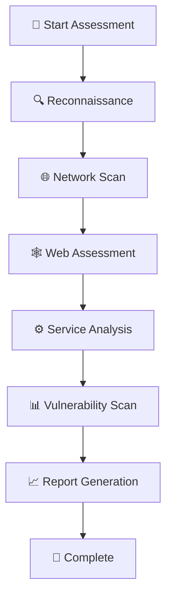

# 🔒 Cyber Security Assessment Platform


> **Enterprise-Grade Security Scanning · Automated Vulnerability Assessment · Professional Compliance Reporting**

## 🎯 What Problem Does This Solve?

**Are you tired of...**
- ❌ Manual security assessments that take hours?
- ❌ Inconsistent reporting across different tools?
- ❌ Missing critical vulnerabilities in your scans?
- ❌ Struggling with compliance documentation?

**We provide...**
- ✅ **Automated** multi-phase security assessments
- ✅ **Consistent** professional reporting
- ✅ **Comprehensive** vulnerability coverage
- ✅ **Compliance-ready** audit documentation

---

## 🚀 Get Started in 60 Seconds

### 🛠️ Quick Installation

```bash
# 1. Clone and setup
git clone https://github.com/yourusername/cyber-security-assessment-platform.git
cd cyber-security-assessment-platform
chmod +x professional_security_assessment.sh

# 2. Install dependencies (one command)
sudo apt update && sudo apt install -y nmap curl dnsutils whois nikto whatweb openssl

# 3. Run your first assessment
./professional_security_assessment.sh -t your-domain.com -i standard -v
```

### 🎯 First Scan - See Immediate Results

```bash
# Quick security health check (5-10 minutes)
./professional_security_assessment.sh -t your-app.com -i light -m web,services -q

# What you'll get:
# ✅ Security headers analysis
# ✅ Open port detection  
# ✅ Web vulnerability scan
# ✅ Executive summary report
```

---

## 📊 See It In Action

### 🎬 Before & After Comparison

**Traditional Approach:**
```bash
# Manual process - 2+ hours
nmap target.com
curl -I target.com
nikto -h target.com
dig target.com
# ...and 10 more commands
# Manual report creation - 1 hour
```

**Our Platform:**
```bash
# Automated process - 30 minutes
./professional_security_assessment.sh -t target.com -i comprehensive

# Results: 
# 🎯 Comprehensive scan completed
# 📈 5 Professional reports generated  
# 🔍 200+ security checks performed
# ⏱️ Time saved: 90%
```

### 📈 Sample Output Dashboard

```
📁 Security_Reports/target_20241010_143022/
├── 🎯 Executive_Summary.md          # For management
├── 🔧 Technical_Report.md           # For IT teams  
├── 🛠️ Remediation_Guide.md          # Step-by-step fixes
├── 📊 Comprehensive_Report.md       # Full details
└── 📋 Assessment_Manifest.txt       # Methodology proof
```

---

## 🏗️ How It Works

### 🎯 Multi-Phase Assessment Architecture



### 🧩 Choose Your Assessment Level

| Level | ⏱️ Time | 🎯 Best For | 📊 Coverage |
|-------|---------|-------------|-------------|
| **Light** | 5-10 min | Quick checks, CI/CD | Essential security |
| **Standard** | 15-30 min | Regular audits | Balanced depth |
| **Comprehensive** | 45-90 min | Full penetration tests | Maximum coverage |

---

## 💡 Real-World Use Cases

### 🏢 Enterprise Security Teams
```bash
# Complete corporate assessment
./professional_security_assessment.sh \
  -t company-domain.com \
  -i comprehensive \
  -o "/security/audits/q4_2024" \
  --user-agent "Corporate-Security-Scanner/3.0" \
  -v
```

### 🔧 Development Teams
```bash
# Pre-production security check
./professional_security_assessment.sh \
  -t staging-app.com \
  -m web,vulnerability \
  -i light \
  -q \
  --timeout 30
```

### 📋 Compliance Auditors
```bash
# Regulatory compliance assessment
./professional_security_assessment.sh \
  -t audit-target.org \
  -c compliance_config.conf \
  -i comprehensive \
  -m all
```

---

## 🎛️ Interactive Configuration

### 🎚️ Choose Your Scan Intensity

```bash
# 🟢 Light - Fast security check
./professional_security_assessment.sh -t target.com -i light

# 🟡 Standard - Balanced assessment  
./professional_security_assessment.sh -t target.com -i standard

# 🔴 Comprehensive - Deep penetration test
./professional_security_assessment.sh -t target.com -i comprehensive
```

### 🧩 Mix & Match Modules

```bash
# External security assessment
./professional_security_assessment.sh -t target.com -m recon,network,web

# Internal network focus
./professional_security_assessment.sh -t 192.168.1.0/24 -m network,services

# Web application security
./professional_security_assessment.sh -t webapp.com -m web,vulnerability,reporting
```

---

## 📈 What You'll Discover

### 🔍 Security Findings Examples

| Category | What We Find | Why It Matters |
|----------|--------------|----------------|
| **Network Security** | Open ports, services, configurations | Prevent unauthorized access |
| **Web Vulnerabilities** | SQLi, XSS, security headers | Protect user data and applications |
| **Service Hardening** | SSH configs, weak protocols | Reduce attack surface |
| **Compliance Gaps** | Missing security controls | Meet regulatory requirements |

### 📊 Sample Risk Assessment

```
Risk Level: MEDIUM (62/100)

🟢 LOW RISK (0-30):
- Minor configuration issues
- Informational findings

🟡 MEDIUM RISK (31-70): 
- Missing security headers
- Outdated service versions
- Information disclosure

🔴 HIGH RISK (71-100):
- Critical vulnerabilities
- Data exposure risks
- Immediate action required
```

---

## 🛠️ Advanced Features

### ⚡ Performance Optimization

```bash
# High-performance scanning
./professional_security_assessment.sh \
  -t large-network.com \
  --threads 15 \
  --timeout 60 \
  -q
```

### 🔄 Integration Ready

```bash
# CI/CD Pipeline Integration
./professional_security_assessment.sh \
  -t ${DEPLOYMENT_URL} \
  -m web \
  -i light \
  -q \
  --timeout 30

# Exit code indicates security status
if [ $? -eq 0 ]; then
    echo "✅ Security check passed"
else
    echo "❌ Security issues found"
    exit 1
fi
```

### 📋 Compliance Frameworks

| Framework | Support Level | Documentation |
|-----------|---------------|---------------|
| **NIST SP 800-115** | ✅ Full compliance | Included in reports |
| **PTES** | ✅ Methodology aligned | Standardized approach |
| **OWASP** | ✅ Testing guide | Web application focus |
| **ISO 27001** | ⚠️ Partial mapping | Custom config needed |

---


---

## 🤝 Community & Support

### 🐛 Found an Issue?
```bash
# 1. Check existing issues
# 2. Run with verbose mode for details
./professional_security_assessment.sh -t test.com -v

# 3. Create issue with:
#    - Error output
#    - Command used  
#    - System information
```


---

## ⚠️ Security & Ethics

### 🛡️ Responsible Usage Promise

**We believe in:**
```bash
# ✅ Authorized testing only
./professional_security_assessment.sh -t your-own-domain.com

# ✅ Educational purposes  
./professional_security_assessment.sh -t test-lab.local

# ✅ Compliance with laws
# Always get written permission before scanning
```

**We prohibit:**
```bash
# ❌ Unauthorized scanning
# ❌ Malicious attacks  
# ❌ Privacy violations
# ❌ Any illegal activities
```

### 🔐 Security First
- No data collection or telemetry
- All processing happens locally
- Open source and transparent
- Regular security reviews

---

## 📞 Get Help & Stay Updated

### 🔔 Support Channels
- **Documentation**: [Full docs here](docs/)
- **Issues**: [GitHub Issues](issues)
- **Discussions**: [Community Forum](discussions)
- **Security**: [security@example.com](mailto:security@example.com)

### 📰 Latest Updates
```bash
# Get the latest version
git pull origin main

# Check for updates
./professional_security_assessment.sh --version

# View changelog
cat CHANGELOG.md
```

---

## 🏆 Why Choose Our Platform?

| Feature | Traditional Tools | Our Platform |
|---------|------------------|--------------|
| **Setup Time** | 30+ minutes | 2 minutes |
| **Report Quality** | Basic output | Professional docs |
| **Coverage** | Limited scope | Comprehensive |
| **Compliance** | Manual mapping | Built-in frameworks |
| **Automation** | Scripting required | One-command operation |

---

<div align="center">

## 🚀 Ready to Secure Your Systems?

```bash
# Start your first assessment now
git clone https://github.com/yourusername/cyber-security-assessment-platform.git
cd cyber-security-assessment-platform
./professional_security_assessment.sh -t your-domain.com -i standard -v
```

**⭐ Star us on GitHub · 🐛 Report Issues · 💡 Suggest Features**

**🔒 Secure Your Future · 🚀 Start Scanning Today**

</div>

---

*Last updated: October 2024 · Version 3.0 · [View Changelog](CHANGELOG.md)*
